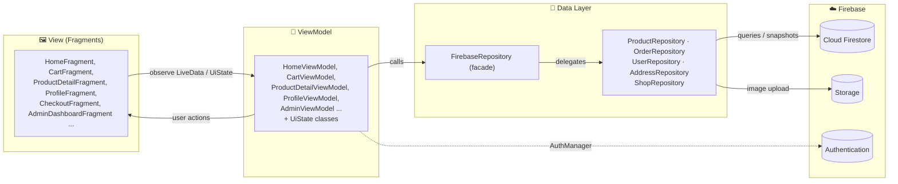
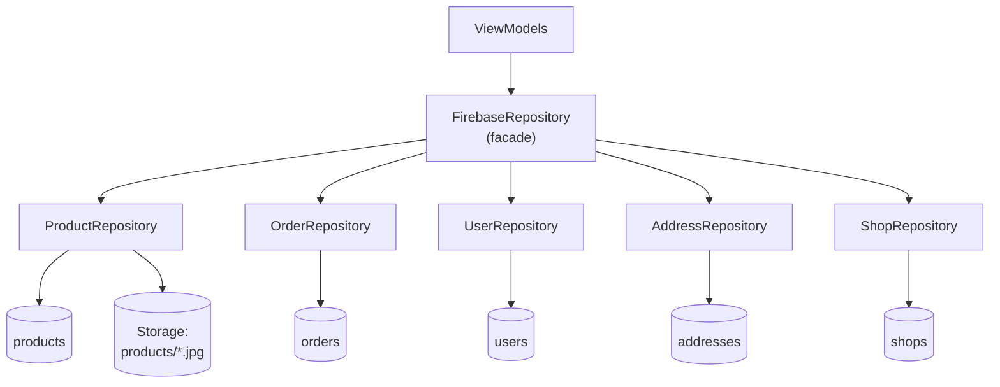
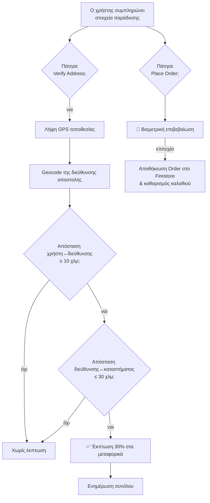

<div align="center">

# 🛒 PricePulse

### Mobile e-commerce εφαρμογή για Android, με ζωντανό κατάλογο προϊόντων, καλάθι, παραγγελίες, πολυκαταστηματική λογική και role-aware admin dashboard.


</div>

---

## 📑 Πίνακας περιεχομένων

- [Επισκόπηση](#-επισκόπηση)
- [Βασικά χαρακτηριστικά](#-βασικά-χαρακτηριστικά)
- [Τεχνολογίες](#-τεχνολογίες)
- [Αρχιτεκτονική (MVVM)](#-αρχιτεκτονική-mvvm)
- [Δομή του project](#-δομή-του-project)
- [Το επίπεδο δεδομένων — Firebase Repositories](#-το-επίπεδο-δεδομένων--firebase-repositories)
- [Μοντέλο δεδομένων στο Firestore](#-μοντέλο-δεδομένων-στο-firestore)
- [Σημαντικά αρχεία & ο ρόλος τους](#-σημαντικά-αρχεία--ο-ρόλος-τους)
- [Βασικές ροές της εφαρμογής](#-βασικές-ροές-της-εφαρμογής)
- [Ρόλοι & δικαιώματα](#-ρόλοι--δικαιώματα)
- [Εγκατάσταση & εκτέλεση](#-εγκατάσταση--εκτέλεση)
- [Αρχικοποίηση δεδομένων (Seeding)](#-αρχικοποίηση-δεδομένων-seeding)
- [Συμβάσεις κώδικα](#-συμβάσεις-κώδικα)

---

## 🔎 Επισκόπηση

Το **PricePulse** είναι μια εφαρμογή ηλεκτρονικού καταστήματος για Android, γραμμένη σε **Java** με backend το **Firebase** (Authentication + Cloud Firestore + Storage). Ο σχεδιασμός ακολουθεί το πρότυπο **MVVM** (Model–View–ViewModel) με σαφή διαχωρισμό ευθυνών:

- Οι **οθόνες** (Fragments) είναι «χαζές» — απλώς παρατηρούν κατάσταση και προωθούν τις ενέργειες του χρήστη.
- Τα **ViewModels** κρατούν την κατάσταση και την επιχειρησιακή λογική, ανεξάρτητα από τον κύκλο ζωής του UI.
- Το **επίπεδο δεδομένων** (repositories) είναι η μοναδική πύλη προς το Firebase.

Η εφαρμογή είναι **single-activity**: υπάρχει μία `MainActivity` και η πλοήγηση γίνεται με το **Navigation Component** ανάμεσα σε Fragments, με ένα κάτω bottom navigation bar.

Υποστηρίζει τρεις ρόλους χρηστών — **απλό χρήστη**, **ιδιοκτήτη καταστήματος (shop owner)** και **διαχειριστή (admin)** — με δυναμικό περιεχόμενο ανά ρόλο.

---

## ✨ Βασικά χαρακτηριστικά

#### 👤 Για τον χρήστη
- 🔐 Εγγραφή / σύνδεση με email & κωδικό (Firebase Auth), αλλαγή ονόματος / email / κωδικού.
- 🏠 Αρχική με ζωντανό κατάλογο προϊόντων και φιλτράρισμα ανά κατηγορία.
- 🔍 Αναζήτηση με **debounce** και προτάσεις.
- 📄 Σελίδα προϊόντος με εικόνες, βαθμολογία, **κριτικές (reviews)** και κάρτα καταστήματος.
- ❤️ Λίστα επιθυμιών (wishlist) συγχρονισμένη με τον λογαριασμό.
- 🛒 Καλάθι σε πραγματικό χρόνο με badge στο bottom navigation.
- 📦 Checkout με αποθηκευμένες διευθύνσεις, **έκπτωση βάσει τοποθεσίας** και **βιομετρική επιβεβαίωση** της παραγγελίας.
- 🗂️ Ιστορικό παραγγελιών & διαχείριση αποθηκευμένων διευθύνσεων.

#### 🏪 Για τον ιδιοκτήτη καταστήματος
- 📊 Επισκόπηση καταστήματος (προϊόντα, εκκρεμείς παραγγελίες, μηνιαία έσοδα, βαθμολογία).
- 🧾 Διαχείριση παραγγελιών (αλλαγή κατάστασης: Pending / In Transit / Completed).
- ➕ Προσθήκη προϊόντων (με ανέβασμα εικόνας στο Firebase Storage ή URL).
- ⚙️ Επεξεργασία στοιχείων καταστήματος.

#### 🛡️ Για τον διαχειριστή
- 🌐 Επισκόπηση όλης της πλατφόρμας (σύνολα από όλα τα καταστήματα).
- 🏬 CRUD καταστημάτων.
- 👥 Προαγωγή / αφαίρεση admins και shop owners μέσω email.

---

## 🧰 Τεχνολογίες

| Κατηγορία | Τεχνολογία |
|---|---|
| Γλώσσα | Java 11 |
| UI | Android Views + **ViewBinding** |
| Αρχιτεκτονική | MVVM (ViewModel + LiveData) |
| Πλοήγηση | AndroidX Navigation Component |
| Backend | Firebase **Authentication**, Cloud **Firestore**, **Storage** |
| Εικόνες | **Glide** |
| Loading placeholders | **Facebook Shimmer** |
| Ασφάλεια checkout | AndroidX **Biometric** |
| Λίστες | RecyclerView + **ListAdapter / DiffUtil** |
| Τοποθεσία | Android `LocationManager` + `Geocoder` |

> minSdk **24** · compileSdk/targetSdk **35** · Firebase BoM **33.5.1**

---

## 🏛️ Αρχιτεκτονική (MVVM)

Η ροή δεδομένων είναι μονόδρομη: το UI παρατηρεί `LiveData` από το ViewModel, το ViewModel μιλάει στο repository, και το repository στο Firebase. Οι ενέργειες του χρήστη ταξιδεύουν προς την αντίθετη κατεύθυνση (callbacks).



**Γιατί αυτό το πρότυπο;** Επειδή τα `ViewModel` επιβιώνουν στις αλλαγές διαμόρφωσης (π.χ. περιστροφή οθόνης), η κατάσταση δεν χάνεται. Επειδή το UI απλώς παρατηρεί, δεν υπάρχει χειροκίνητος συγχρονισμός. Και επειδή όλη η πρόσβαση στο Firebase περνά από τα repositories, η υπόλοιπη εφαρμογή δεν «ξέρει» καθόλου το Firestore.

---

## 📁 Δομή του project

```
PricePulse/
├── app/
│   ├── build.gradle                     # εξαρτήσεις & ρυθμίσεις του module
│   ├── google-services.json             # ρυθμίσεις σύνδεσης με το Firebase project
│   └── src/main/
│       ├── AndroidManifest.xml          # permissions (INTERNET, LOCATION) & δήλωση MainActivity
│       ├── java/com/pricepulse/
│       │   ├── MainActivity.java        # μοναδικό Activity: Navigation + bottom nav + badge καλαθιού
│       │   │
│       │   ├── model/                   # POJO μοντέλα = τα έγγραφα του Firestore
│       │   │   ├── Product.java         #   προϊόν (+ ενσωματωμένα reviews)
│       │   │   ├── Order.java           #   παραγγελία (items, στοιχεία αποστολής, έκπτωση)
│       │   │   ├── CartItem.java        #   γραμμή καλαθιού
│       │   │   ├── Address.java         #   αποθηκευμένη διεύθυνση παράδοσης
│       │   │   ├── Review.java          #   κριτική προϊόντος
│       │   │   ├── Shop.java            #   κατάστημα (+ συντεταγμένες)
│       │   │   └── User.java            #   προφίλ χρήστη + ρόλοι + wishlist
│       │   │
│       │   ├── repository/              #  επίπεδο δεδομένων (Firebase)
│       │   │   ├── FirebaseRepository.java   #   facade — ενιαίο API
│       │   │   ├── ProductRepository.java    #   προϊόντα, reviews, εικόνες
│       │   │   ├── OrderRepository.java      #   παραγγελίες
│       │   │   ├── UserRepository.java       #   χρήστες, ρόλοι, wishlist
│       │   │   ├── AddressRepository.java    #   διευθύνσεις
│       │   │   ├── ShopRepository.java       #   καταστήματα
│       │   │   └── RepoCallback.java         #   απλό callback interface
│       │   │
│       │   ├── viewmodel/               # ViewModels + αναπαράσταση κατάστασης UI
│       │   │   ├── HomeViewModel.java          + HomeUiState.java
│       │   │   ├── SearchViewModel.java        + SearchUiState.java
│       │   │   ├── ProductDetailViewModel.java + ProductDetailUiState.java
│       │   │   ├── CartViewModel.java          + CartUiState.java
│       │   │   ├── ProfileViewModel.java       + ProfileTabState.java + SettingsEvent.java
│       │   │   ├── AdminViewModel.java
│       │   │   └── SingleLiveEvent.java        # one-shot events (toasts/navigation)
│       │   │
│       │   ├── ui/
│       │   │   ├── fragments/           # οι οθόνες της εφαρμογής
│       │   │   └── adapters/            # RecyclerView adapters
│       │   │
│       │   ├── auth/AuthManager.java    # wrapper πάνω από το Firebase Authentication
│       │   ├── cart/CartManager.java    # in-memory καλάθι (singleton)
│       │   ├── admin/
│       │   │   ├── AdminConfig.java     # αρχικά (seed) admin emails
│       │   │   └── AdminSession.java    # ζωντανή κατάσταση ρόλων του τρέχοντος χρήστη
│       │   └── util/
│       │       ├── FirestoreSeeder.java        # γέμισμα της βάσης με demo δεδομένα
│       │       ├── ImageLoader.java            # ασφαλές φόρτωμα εικόνων με Glide
│       │       └── LocationDiscountHelper.java # υπολογισμός έκπτωσης βάσει τοποθεσίας
│       │
│       └── res/
│           ├── layout/                  # XML οθονών & στοιχείων λίστας
│           ├── drawable/                # εικονίδια & σχήματα
│           ├── navigation/nav_graph.xml # γράφος πλοήγησης
│           ├── menu/bottom_nav_menu.xml # κάτω μενού
│           └── values/                  # colors, strings, themes
├── build.gradle / settings.gradle      # ρυθμίσεις σε επίπεδο project
└── gradlew / gradlew.bat               # Gradle wrapper
```

---

##  Το επίπεδο δεδομένων — Firebase Repositories

Αυτό είναι το πιο σημαντικό κομμάτι της αρχιτεκτονικής, οπότε αξίζει αναλυτική εξήγηση.

### Η φιλοσοφία

Όλη η επικοινωνία με το Firebase είναι **κρυμμένη πίσω από τα repositories**. Κανένα ViewModel ή Fragment δεν αγγίζει απευθείας το `FirebaseFirestore`. Έτσι, αν αύριο αλλάξει το backend, αλλάζει μόνο αυτό το πακέτο.

### Το `RepoCallback<T>` — η «κόλλα»

Επειδή όλες οι κλήσεις στο Firebase είναι **ασύγχρονες**, τα repositories δεν επιστρέφουν τιμές κατευθείαν· επιστρέφουν το αποτέλεσμα μέσω ενός μικρού callback:

```java
public interface RepoCallback<T> {
    void onComplete(T result);
}
```

Το ViewModel καλεί μια μέθοδο και δίνει ένα callback (συνήθως ως lambda) που τοποθετεί το αποτέλεσμα σε `LiveData`.

### Facade + per-domain repositories

Το `FirebaseRepository` είναι ένα **facade**: κρατά ένα ενιαίο, σταθερό API για τα ViewModels, αλλά **αναθέτει** την πραγματική δουλειά σε πέντε εξειδικευμένα repositories — ένα ανά «τομέα» δεδομένων (collection):



| Repository | Ευθύνη | Firestore collection |
|---|---|---|
| `ProductRepository` | Προϊόντα, αναζήτηση, κριτικές, ανέβασμα εικόνων, propagation πεδίων καταστήματος | `products` (+ Storage) |
| `OrderRepository` | Δημιουργία & ζωντανή παρακολούθηση παραγγελιών, αλλαγή κατάστασης | `orders` |
| `UserRepository` | Προφίλ, ρόλοι (admin/shopOwner), wishlist, σύνδεση ιδιοκτήτη↔κατάστημα | `users` (+ `shops` για το link) |
| `AddressRepository` | Αποθηκευμένες διευθύνσεις, default διεύθυνση | `addresses` |
| `ShopRepository` | Ανάγνωση & αποθήκευση καταστημάτων | `shops` |

> Πλεονέκτημα: ο πελάτης (ViewModel) δεν αλλάζει — βλέπει πάντα το `FirebaseRepository` — ενώ η λογική κάθε τομέα ζει σε μικρό, ευανάγνωστο αρχείο.

### Δύο τύποι μεθόδων: realtime vs one-shot

**1. Realtime (`listen…`)** — εγγράφονται με `addSnapshotListener` και ενημερώνουν το UI **αυτόματα** σε κάθε αλλαγή της βάσης. Επιστρέφουν ένα `ListenerRegistration` που **πρέπει** να καθαριστεί:

```java
public ListenerRegistration listenToProductsByShop(String shopId,
                                                    RepoCallback<List<Product>> callback) {
    return productsCollection.whereEqualTo("shopId", shopId)
            .addSnapshotListener((snapshot, error) -> {
                if (error != null) {                       // σφάλμα -> κενή λίστα, ποτέ crash
                    callback.onComplete(new ArrayList<>());
                    return;
                }
                callback.onComplete(snapshot != null
                        ? snapshot.toObjects(Product.class) : new ArrayList<>());
            });
}
```

**2. One-shot** — απλές εγγραφές/αναγνώσεις (`set`, `get`, `delete`) με success/failure listeners, χωρίς επιστροφή `ListenerRegistration`.

### Διαχείριση κύκλου ζωής (πολύ σημαντικό)

Κάθε `ListenerRegistration` αποθηκεύεται στο ViewModel και αφαιρείται στο `onCleared()` (ή στο `onDestroyView()` του Fragment), ώστε να **μην υπάρχουν memory leaks** ή listeners που τρέχουν στο κενό:

```java
@Override
protected void onCleared() {
    super.onCleared();
    if (registration != null) {
        registration.remove();   // ξε-εγγραφή από το Firestore
        registration = null;
    }
}
```

### Ειδικές, «έξυπνες» λειτουργίες

- **Transaction στις κριτικές** — `ProductRepository.submitReview` τρέχει ένα Firestore *transaction*: προσθέτει την κριτική **και** ξαναϋπολογίζει `rating` + `reviewCount` ατομικά, ώστε να μη χαλάνε οι μέσοι όροι σε ταυτόχρονες εγγραφές.
- **Batch για default διεύθυνση** — `AddressRepository.setDefaultAddress` ενημερώνει με ένα *batch* όλες τις διευθύνσεις του χρήστη, εγγυώμενο ότι **μόνο μία** μένει default.
- **Batch σύνδεση ιδιοκτήτη↔κατάστημα** — `UserRepository.linkShopOwner` / `unlinkShopOwner` ενημερώνουν σε ένα batch τόσο τον χρήστη (ρόλος + `ownedShopId`) όσο και το κατάστημα (`ownerId` + `ownerEmail`).
- **Denormalization** — κάθε προϊόν κουβαλά `shopName` & `shopActive`, ώστε η Αρχική/Αναζήτηση να φιλτράρουν χωρίς επιπλέον fetch. Όταν αλλάζει ένα κατάστημα, η `propagateShopFields` ενημερώνει με batch όλα τα προϊόντα του.
- **Σταθερή ταξινόμηση** — οι παραγγελίες ταξινομούνται με τον κοινό `NEWEST_FIRST` comparator (νεότερες πρώτα), οι διευθύνσεις με «default πρώτα, μετά νεότερες».

---

## 🗄️ Μοντέλο δεδομένων στο Firestore

Η βάση έχει πέντε collections και ένα bucket στο Storage για τις εικόνες προϊόντων.

#### `products`
| Πεδίο | Τύπος | Περιγραφή |
|---|---|---|
| `id`, `title`, `description` | String | βασικά στοιχεία |
| `price` | double | τιμή |
| `imageUrl` | String | εικόνα (URL ή Storage link) |
| `category` | String | Electronics / Fashion / Home / Sports / Beauty / Books |
| `rating`, `reviewCount` | double / int | μέσος όρος & πλήθος κριτικών |
| `shopId`, `shopName`, `shopActive` | String / boolean | denormalized στοιχεία καταστήματος |
| `reviews` | List\<Review\> | ενσωματωμένες κριτικές |

#### `users`
| Πεδίο | Τύπος | Περιγραφή |
|---|---|---|
| `uid`, `email`, `displayName` | String | ταυτότητα |
| `likedProductIds` | List\<String\> | wishlist |
| `admin`, `shopOwner` | boolean | ρόλοι |
| `ownedShopId` | String | κατάστημα που διαχειρίζεται ο owner |

#### `orders`
| Πεδίο | Τύπος | Περιγραφή |
|---|---|---|
| `id`, `userId`, `shopId` | String | συσχετίσεις |
| `items` | List\<CartItem\> | περιεχόμενο παραγγελίας |
| `totalAmount`, `finalTotalAmount` | double | σύνολο πριν/μετά την έκπτωση |
| `deliveryFee`, `deliveryDiscountAmount`, `locationDiscountApplied` | double/boolean | έκπτωση παράδοσης |
| `status` | String | Pending / In Transit / Completed |
| `timestamp` | long | χρόνος δημιουργίας |
| `shipping…`, `paymentMethod` | String | στοιχεία αποστολής & πληρωμής |

#### `addresses`
| Πεδίο | Τύπος | Περιγραφή |
|---|---|---|
| `id`, `userId` | String | συσχέτιση με χρήστη |
| `label` | String | Home / Work / Other |
| `fullName`, `phone`, `addressLine`, `city`, `postalCode` | String | στοιχεία παράδοσης |
| `defaultAddress` | boolean | προεπιλεγμένη διεύθυνση |

#### `shops`
| Πεδίο | Τύπος | Περιγραφή |
|---|---|---|
| `id`, `ownerId`, `ownerEmail` | String | ταυτότητα & ιδιοκτήτης |
| `name`, `description`, `mainCategory` | String | παρουσίαση |
| `businessEmail`, `businessPhone`, `address`, `openingHours`, `deliveryOptions` | String | επιχειρηματικά στοιχεία |
| `rating`, `productCount`, `active` | double/int/boolean | στατιστικά & κατάσταση |
| `latitude`, `longitude` | double | συντεταγμένες (για την έκπτωση τοποθεσίας) |

> 📷 **Storage:** οι εικόνες προϊόντων ανεβαίνουν στο μονοπάτι `products/<uuid>.jpg` και το download URL αποθηκεύεται στο πεδίο `imageUrl` του προϊόντος.

---

## 🧩 Σημαντικά αρχεία & ο ρόλος τους

### Πυρήνας
| Αρχείο | Ρόλος |
|---|---|
| `MainActivity.java` | Το μοναδικό Activity. Στήνει το Navigation Component, το bottom navigation, κρύβει το nav bar σε λεπτομέρεια προϊόντος/admin και δείχνει το **badge** με το πλήθος του καλαθιού. |
| `RepoCallback.java` | Το γενικό callback interface για όλες τις ασύγχρονες απαντήσεις των repositories. |

### Managers & Session (Singletons)
| Αρχείο | Ρόλος |
|---|---|
| `auth/AuthManager.java` | Wrapper πάνω από το Firebase Authentication: `signUp`, `signIn`, `signOut`, αλλαγή ονόματος, και αλλαγή email/κωδικού **με επανα-πιστοποίηση** (re-auth). Εκθέτει `LiveData<FirebaseUser>`. |
| `cart/CartManager.java` | **Singleton** in-memory καλάθι. Κρατά τα είδη και το πλήθος ως `LiveData`. Προσοχή: το καλάθι ζει όσο η συνεδρία της εφαρμογής (δεν αποθηκεύεται στη βάση). |
| `admin/AdminConfig.java` | Λίστα με τα αρχικά (**seed**) admin emails — αυτά γίνονται admin την πρώτη φορά που συνδέονται. |
| `admin/AdminSession.java` | **Singleton** που ακούει σε πραγματικό χρόνο το προφίλ του τρέχοντος χρήστη και εκθέτει `isAdmin` / `isShopOwner` / `ownedShopId` / `canAccessDashboard`. Στο πρώτο login δημιουργεί το user document (και βάζει admin αν το email είναι seed). |

### ViewModels
| Αρχείο | Ρόλος |
|---|---|
| `HomeViewModel` | Ζωντανός κατάλογος ανά κατηγορία (όριο 20), φιλτράρει προϊόντα ανενεργών καταστημάτων. |
| `SearchViewModel` | Αναζήτηση με **debounce 400ms**, ελάχιστο 3 χαρακτήρες, ακύρωση παλιών αιτημάτων με token. |
| `ProductDetailViewModel` | Φορτώνει προϊόν + κατάστημα + κατάσταση wishlist, υποβάλλει κριτικές, κάνει **optimistic** like/unlike. |
| `CartViewModel` | Υπολογίζει το σύνολο (`MediatorLiveData`), εκτελεί το checkout (φτιάχνει το `Order` και προσομοιώνει επεξεργασία). |
| `ProfileViewModel` | Διαχειρίζεται τις «καρτέλες» του προφίλ, wishlist, ιστορικό παραγγελιών, διευθύνσεις και ενέργειες ρυθμίσεων· προσαρτά/αποσπά listeners ανάλογα με το login. |
| `AdminViewModel` | Όλη η λογική του dashboard: παραγγελίες, admins, shop owners, επισκόπηση καταστήματος & πλατφόρμας, προσθήκη προϊόντος, διαχείριση ρόλων & καταστημάτων. |
| `*UiState`, `ProfileTabState`, `SettingsEvent` | Αναπαριστούν τις πιθανές καταστάσεις μιας οθόνης (Loading/Success/Error/Empty/Idle) ως κλειστές ιεραρχίες κλάσεων. |
| `SingleLiveEvent` | Ειδικό `LiveData` για **one-shot** γεγονότα (toast, πλοήγηση) που δεν πρέπει να ξανα-ενεργοποιούνται μετά από αλλαγή διαμόρφωσης. |

### Οθόνες (`ui/fragments`)
| Αρχείο | Οθόνη |
|---|---|
| `HomeFragment` | Αρχική με κατηγορίες & πλέγμα προϊόντων (shimmer στο φόρτωμα). |
| `SearchFragment` | Αναζήτηση με προτάσεις & αποτελέσματα. |
| `ProductDetailFragment` | Λεπτομέρεια προϊόντος, κριτικές, like, animation «προστέθηκε στο καλάθι». |
| `CartFragment` | Καλάθι & μετάβαση στο checkout. |
| `CheckoutFragment` | Φόρμα παράδοσης, έκπτωση τοποθεσίας, τρόπος πληρωμής, **βιομετρική** επιβεβαίωση. |
| `ProfileFragment` | Λογαριασμός: wishlist, παραγγελίες, διευθύνσεις, ρυθμίσεις, help, είσοδος για guest. |
| `AdminDashboardFragment` | Role-aware dashboard με δυναμικές καρτέλες ανά ρόλο. |
| `SavedAddressPickerBottomSheetFragment` | Bottom sheet για επιλογή αποθηκευμένης διεύθυνσης στο checkout. |

### Adapters (`ui/adapters`)
RecyclerView adapters βασισμένα σε `ListAdapter` + `DiffUtil` (αποδοτικά updates): `ProductAdapter` (+`ProductListItem` για shimmer/προϊόν), `CategoryAdapter`, `CartAdapter`, `CheckoutSummaryAdapter`, `OrderAdapter`, `AdminOrderAdapter`, `AdminUserAdapter`, `ShopAdapter`, `AddressAdapter`, `AddressPickerAdapter`, `WishlistAdapter`, `FaqAdapter`.

### Utilities (`util`)
| Αρχείο | Ρόλος |
|---|---|
| `ImageLoader.java` | Κεντρικό, ασφαλές φόρτωμα εικόνων με Glide (placeholder/error, caching) ώστε να μη «σκάει» σε κενά/σπασμένα URL. |
| `LocationDiscountHelper.java` | Υπολογίζει αν δικαιούται **έκπτωση παράδοσης** βάσει τοποθεσίας (βλ. ροή παρακάτω). Τρέχει σε background executor. |
| `FirestoreSeeder.java` | Γεμίζει τη βάση με demo δεδομένα (10 προϊόντα + 1 προεπιλεγμένο κατάστημα). |

---

## 🔄 Βασικές ροές της εφαρμογής

### Πιστοποίηση & ρόλοι
1. Ο χρήστης συνδέεται/εγγράφεται μέσω `AuthManager`.
2. Το `AdminSession` ακούει το έγγραφό του στο `users` και υπολογίζει σε πραγματικό χρόνο τους ρόλους.
3. Το `canAccessDashboard` ανοίγει/κλείνει το admin dashboard δυναμικά — αν αφαιρεθεί ο ρόλος ενώ ο χρήστης είναι μέσα, η οθόνη κλείνει αυτόματα.

### Περιήγηση & αναζήτηση
- Η Αρχική παρακολουθεί ζωντανά τα προϊόντα ανά κατηγορία· τα προϊόντα ανενεργών καταστημάτων φιλτράρονται.
- Η Αναζήτηση κάνει debounce και φέρνει έως 100 προϊόντα, φιλτράροντας σε τίτλο/κατηγορία.

### Καλάθι & Checkout (με έκπτωση τοποθεσίας + βιομετρικά)



Σταθερές της έκπτωσης (στο `LocationDiscountHelper`): μέγιστη απόσταση χρήστη↔διεύθυνσης **10 χλμ**, διεύθυνσης↔καταστήματος **30 χλμ**, ποσοστό έκπτωσης **30%**. Στο checkout το πάγιο κόστος παράδοσης είναι **3,50 €**.

### Admin / Shop owner dashboard
Το `AdminDashboardFragment` χτίζει **δυναμικά** τις καρτέλες του ανάλογα με τον ρόλο:
- **Shop owner:** Επισκόπηση (στατιστικά καταστήματος) · Στοιχεία καταστήματος · Παραγγελίες · Προσθήκη προϊόντος.
- **Admin:** Επισκόπηση (στατιστικά πλατφόρμας) · Καταστήματα (CRUD) · Διαχείριση admins & shop owners.

---

## 🔐 Ρόλοι & δικαιώματα

| Δυνατότητα | Χρήστης | Shop owner | Admin |
|---|:---:|:---:|:---:|
| Περιήγηση, καλάθι, checkout | ✅ | ✅ | ✅ |
| Wishlist, κριτικές, διευθύνσεις | ✅ | ✅ | ✅ |
| Διαχείριση **δικού** του καταστήματος | — | ✅ | — |
| Παραγγελίες/προϊόντα καταστήματος | — | ✅ | — |
| Επισκόπηση όλης της πλατφόρμας | — | — | ✅ |
| CRUD καταστημάτων | — | — | ✅ |
| Προαγωγή/αφαίρεση admins & owners | — | — | ✅ |

> Οι αρχικοί admins ορίζονται στο `AdminConfig.SEED_ADMIN_EMAILS`. Από εκεί και πέρα, η ιδιότητα φυλάσσεται στο πεδίο `admin` του εκάστοτε user document στο Firestore.

---

## ⚙️ Εγκατάσταση & εκτέλεση

#### Προαπαιτούμενα
- **Android Studio** (πρόσφατη έκδοση) & **JDK 11+**
- Ένα **Firebase project** με ενεργοποιημένα: Authentication (Email/Password), Cloud Firestore, Storage

#### Βήματα
1. **Κλωνοποίηση** του repository και άνοιγμα στο Android Studio.
2. **Firebase σύνδεση:** τοποθετήστε το δικό σας `google-services.json` στο `app/` (υπάρχει ήδη ένα για το demo project).
3. **`local.properties`:** ορίστε το μονοπάτι του Android SDK — π.χ.:
   ```properties
   sdk.dir=C:\\Users\\<user>\\AppData\\Local\\Android\\Sdk
   ```
   (Το αρχείο **δεν** ανεβαίνει στο git· είναι τοπικό.)
4. **Build από terminal** (ή απλώς ▶️ Run από το IDE):
   ```bash
   ./gradlew assembleDebug          # χτίσιμο APK
   ./gradlew :app:compileDebugJavaWithJavac   # γρήγορος έλεγχος μεταγλώττισης
   ```

#### Permissions
Το `AndroidManifest.xml` δηλώνει: `INTERNET`, `ACCESS_FINE_LOCATION`, `ACCESS_COARSE_LOCATION` (η τοποθεσία χρειάζεται για την έκπτωση παράδοσης).

---

## 🌱 Αρχικοποίηση δεδομένων (Seeding)

Για να γεμίσετε μια άδεια βάση με demo περιεχόμενο, υπάρχει ο `FirestoreSeeder` (10 προϊόντα + 1 προεπιλεγμένο κατάστημα). Στη `MainActivity` υπάρχει η σχετική γραμμή σε σχόλιο:

```java
// new com.pricepulse.util.FirestoreSeeder().seedData();
```

Βγάλτε το σχόλιο, τρέξτε **μία φορά** την εφαρμογή για να γραφτούν τα δεδομένα, και ξανα-βάλτε το σχόλιο ώστε να μην τρέχει σε κάθε εκκίνηση. (Ο seeder ελέγχει αν υπάρχουν ήδη δεδομένα και τα παρακάμπτει.)

---

## ✍️ Συμβάσεις κώδικα

- **Γλώσσα κώδικα:** Αγγλικά (ονόματα κλάσεων, μεθόδων, μεταβλητών).
- **Σχόλια:** στα **Ελληνικά**, και μόνο όπου εξηγούν κάτι μη προφανές (το *γιατί*, όχι το *τι*).
- **UI κατάσταση:** πάντα μέσω `LiveData` + UiState κλάσεων· καμία επιχειρησιακή λογική μέσα στα Fragments.
- **Πρόσβαση στο Firebase:** αποκλειστικά μέσω των repositories.
- **Λίστες:** `ListAdapter` + `DiffUtil` για αποδοτικά, animated updates.

---

<div align="center">

**PricePulse** · φτιαγμένο με ❤️ σε Java & Firebase

</div>
